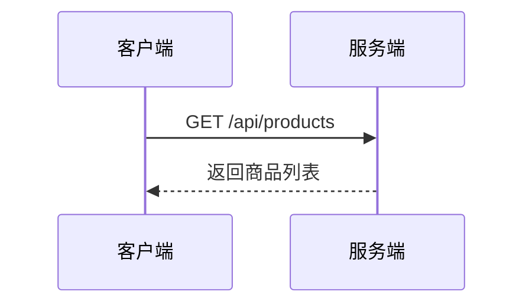

# 商品API接口文档

## 接口概述

本文档描述了B2B生鲜订货商城中商品相关的API接口，包括商品列表、分类、轮播图、搜索等功能。

## 接口列表

### 1. 获取商品列表

**接口名称：** 获取商品列表
**功能描述：** 获取商品列表数据，支持分类筛选和分页查询
**接口地址：** /api/products
**请求方式：** GET

#### 功能说明

用于获取商品列表，支持按分类筛选商品，返回商品的详细信息包括价格、库存、标签等。



#### 请求参数

```json
{
  "categoryId": "fruits",
  "page": 1,
  "pageSize": 10
}
```

| 参数名 | 类型 | 必填 | 说明 | 示例值 |
|-------|------|-----|------|--------|
| categoryId | string | 否 | 分类ID，不传则返回所有商品 | fruits |
| page | int | 否 | 页码（默认1） | 1 |
| pageSize | int | 否 | 每页数量（默认10） | 10 |

#### 响应参数

```json
{
  "error": 0,
  "body": {
    "products": [
      {
        "id": 1,
        "name": "山东红富士苹果",
        "image": "https://images.unsplash.com/photo-1567306301408-9b74779a11af?w=400&h=300&fit=crop",
        "price": 12.8,
        "unit": "kg",
        "stock": 2560,
        "stockUnit": "kg",
        "categoryId": "fruits",
        "tags": ["热销"],
        "description": "新鲜优质山东红富士苹果，口感脆甜"
      }
    ],
    "total": 6
  },
  "message": "获取商品列表成功",
  "success": true
}
```

| 参数名 | 类型 | 必填 | 说明 | 示例值 |
|-------|------|-----|------|--------|
| error | int | 是 | 错误码，0表示成功 | 0 |
| body | object | 是 | 响应数据 | |
| body.products | array | 是 | 商品列表 | |
| body.products.id | int | 是 | 商品ID | 1 |
| body.products.name | string | 是 | 商品名称 | 山东红富士苹果 |
| body.products.image | string | 是 | 商品图片URL | https://... |
| body.products.price | number | 是 | 商品价格 | 12.8 |
| body.products.unit | string | 是 | 价格单位 | kg |
| body.products.stock | int | 是 | 库存数量 | 2560 |
| body.products.stockUnit | string | 是 | 库存单位 | kg |
| body.products.categoryId | string | 是 | 分类ID | fruits |
| body.products.tags | array | 是 | 商品标签 | ["热销"] |
| body.products.description | string | 是 | 商品描述 | 新鲜优质山东红富士苹果，口感脆甜 |
| body.total | int | 是 | 商品总数 | 6 |
| message | string | 是 | 响应消息 | 获取商品列表成功 |
| success | bool | 是 | 是否成功 | true |

---

### 2. 获取商品分类列表

**接口名称：** 获取商品分类列表
**功能描述：** 获取所有商品分类，用于分类导航展示
**接口地址：** /api/categories
**请求方式：** GET

#### 功能说明

获取商品分类列表，用于页面分类导航栏展示。

#### 请求参数

无参数

#### 响应参数

```json
{
  "error": 0,
  "body": {
    "categories": [
      {
        "id": "all",
        "name": "全部",
        "icon": ""
      },
      {
        "id": "vegetables",
        "name": "蔬菜",
        "icon": ""
      },
      {
        "id": "fruits",
        "name": "水果",
        "icon": ""
      }
    ]
  },
  "message": "获取分类列表成功",
  "success": true
}
```

| 参数名 | 类型 | 必填 | 说明 | 示例值 |
|-------|------|-----|------|--------|
| error | int | 是 | 错误码，0表示成功 | 0 |
| body | object | 是 | 响应数据 | |
| body.categories | array | 是 | 分类列表 | |
| body.categories.id | string | 是 | 分类ID | all |
| body.categories.name | string | 是 | 分类名称 | 全部 |
| body.categories.icon | string | 是 | 分类图标 | |
| message | string | 是 | 响应消息 | 获取分类列表成功 |
| success | bool | 是 | 是否成功 | true |

---

### 3. 获取首页轮播图

**接口名称：** 获取首页轮播图
**功能描述：** 获取首页轮播图数据，用于首页轮播展示
**接口地址：** /api/banners
**请求方式：** GET

#### 功能说明

获取首页轮播图数据，包括活动信息和跳转链接。

#### 请求参数

无参数

#### 响应参数

```json
{
  "error": 0,
  "body": {
    "banners": [
      {
        "id": 1,
        "title": "春季特惠专场",
        "subtitle": "全场满100减100",
        "image": "https://images.unsplash.com/photo-1542838132-92c53300491e?w=800&h=300&fit=crop",
        "link": "/promotion/spring",
        "backgroundColor": "#4CAF50"
      }
    ]
  },
  "message": "获取轮播图成功",
  "success": true
}
```

| 参数名 | 类型 | 必填 | 说明 | 示例值 |
|-------|------|-----|------|--------|
| error | int | 是 | 错误码，0表示成功 | 0 |
| body | object | 是 | 响应数据 | |
| body.banners | array | 是 | 轮播图列表 | |
| body.banners.id | int | 是 | 轮播图ID | 1 |
| body.banners.title | string | 是 | 轮播图标题 | 春季特惠专场 |
| body.banners.subtitle | string | 是 | 轮播图副标题 | 全场满100减100 |
| body.banners.image | string | 是 | 轮播图图片URL | https://... |
| body.banners.link | string | 是 | 跳转链接 | /promotion/spring |
| body.banners.backgroundColor | string | 是 | 背景色 | #4CAF50 |
| message | string | 是 | 响应消息 | 获取轮播图成功 |
| success | bool | 是 | 是否成功 | true |

---

### 4. 搜索商品

**接口名称：** 搜索商品
**功能描述：** 根据关键字搜索商品，支持分页查询
**接口地址：** /api/products/search
**请求方式：** GET

#### 功能说明

根据用户输入的关键字搜索商品，支持商品名称模糊匹配。

#### 请求参数

```json
{
  "keyword": "苹果",
  "page": 1,
  "pageSize": 10
}
```

| 参数名 | 类型 | 必填 | 说明 | 示例值 |
|-------|------|-----|------|--------|
| keyword | string | 是 | 搜索关键字 | 苹果 |
| page | int | 否 | 页码（默认1） | 1 |
| pageSize | int | 否 | 每页数量（默认10） | 10 |

#### 响应参数

```json
{
  "error": 0,
  "body": {
    "products": [
      {
        "id": 1,
        "name": "山东红富士苹果",
        "image": "https://images.unsplash.com/photo-1567306301408-9b74779a11af?w=400&h=300&fit=crop",
        "price": 12.8,
        "unit": "kg",
        "stock": 2560,
        "stockUnit": "kg",
        "categoryId": "fruits",
        "tags": ["热销"]
      }
    ],
    "total": 1
  },
  "message": "搜索商品成功",
  "success": true
}
```

| 参数名 | 类型 | 必填 | 说明 | 示例值 |
|-------|------|-----|------|--------|
| error | int | 是 | 错误码，0表示成功 | 0 |
| body | object | 是 | 响应数据 | |
| body.products | array | 是 | 搜索结果商品列表 | |
| body.products.id | int | 是 | 商品ID | 1 |
| body.products.name | string | 是 | 商品名称 | 山东红富士苹果 |
| body.products.image | string | 是 | 商品图片URL | https://... |
| body.products.price | number | 是 | 商品价格 | 12.8 |
| body.products.unit | string | 是 | 价格单位 | kg |
| body.products.stock | int | 是 | 库存数量 | 2560 |
| body.products.stockUnit | string | 是 | 库存单位 | kg |
| body.products.categoryId | string | 是 | 分类ID | fruits |
| body.products.tags | array | 是 | 商品标签 | ["热销"] |
| body.total | int | 是 | 搜索结果总数 | 1 |
| message | string | 是 | 响应消息 | 搜索商品成功 |
| success | bool | 是 | 是否成功 | true |

---

### 5. 获取热销商品

**接口名称：** 获取热销商品
**功能描述：** 获取热销商品列表，用于首页推荐展示
**接口地址：** /api/products/hot
**请求方式：** GET

#### 功能说明

获取热销商品列表，通常用于首页推荐或专题页面展示。

#### 请求参数

```json
{
  "limit": 10
}
```

| 参数名 | 类型 | 必填 | 说明 | 示例值 |
|-------|------|-----|------|--------|
| limit | int | 否 | 返回数量限制（默认10） | 10 |

#### 响应参数

```json
{
  "error": 0,
  "body": {
    "products": [
      {
        "id": 1,
        "name": "山东红富士苹果",
        "image": "https://images.unsplash.com/photo-1567306301408-9b74779a11af?w=400&h=300&fit=crop",
        "price": 12.8,
        "unit": "kg",
        "stock": 2560,
        "stockUnit": "kg",
        "categoryId": "fruits",
        "tags": ["热销"]
      }
    ]
  },
  "message": "获取热销商品成功",
  "success": true
}
```

| 参数名 | 类型 | 必填 | 说明 | 示例值 |
|-------|------|-----|------|--------|
| error | int | 是 | 错误码，0表示成功 | 0 |
| body | object | 是 | 响应数据 | |
| body.products | array | 是 | 热销商品列表 | |
| body.products.id | int | 是 | 商品ID | 1 |
| body.products.name | string | 是 | 商品名称 | 山东红富士苹果 |
| body.products.image | string | 是 | 商品图片URL | https://... |
| body.products.price | number | 是 | 商品价格 | 12.8 |
| body.products.unit | string | 是 | 价格单位 | kg |
| body.products.stock | int | 是 | 库存数量 | 2560 |
| body.products.stockUnit | string | 是 | 库存单位 | kg |
| body.products.categoryId | string | 是 | 分类ID | fruits |
| body.products.tags | array | 是 | 商品标签 | ["热销"] |
| message | string | 是 | 响应消息 | 获取热销商品成功 |
| success | bool | 是 | 是否成功 | true |

---

### 6. 获取新品商品

**接口名称：** 获取新品商品
**功能描述：** 获取新品商品列表，用于新品推荐展示
**接口地址：** /api/products/new
**请求方式：** GET

#### 功能说明

获取新品商品列表，通常用于新品推荐或专题页面展示。

#### 请求参数

```json
{
  "limit": 10
}
```

| 参数名 | 类型 | 必填 | 说明 | 示例值 |
|-------|------|-----|------|--------|
| limit | int | 否 | 返回数量限制（默认10） | 10 |

#### 响应参数

```json
{
  "error": 0,
  "body": {
    "products": [
      {
        "id": 3,
        "name": "挪威三文鱼",
        "image": "https://images.unsplash.com/photo-1544943910-4c1dc44aab44?w=400&h=300&fit=crop",
        "price": 68.0,
        "unit": "kg",
        "stock": 180,
        "stockUnit": "kg",
        "categoryId": "seafood",
        "tags": ["新品"]
      }
    ]
  },
  "message": "获取新品商品成功",
  "success": true
}
```

| 参数名 | 类型 | 必填 | 说明 | 示例值 |
|-------|------|-----|------|--------|
| error | int | 是 | 错误码，0表示成功 | 0 |
| body | object | 是 | 响应数据 | |
| body.products | array | 是 | 新品商品列表 | |
| body.products.id | int | 是 | 商品ID | 3 |
| body.products.name | string | 是 | 商品名称 | 挪威三文鱼 |
| body.products.image | string | 是 | 商品图片URL | https://... |
| body.products.price | number | 是 | 商品价格 | 68.0 |
| body.products.unit | string | 是 | 价格单位 | kg |
| body.products.stock | int | 是 | 库存数量 | 180 |
| body.products.stockUnit | string | 是 | 库存单位 | kg |
| body.products.categoryId | string | 是 | 分类ID | seafood |
| body.products.tags | array | 是 | 商品标签 | ["新品"] |
| message | string | 是 | 响应消息 | 获取新品商品成功 |
| success | bool | 是 | 是否成功 | true |

---

## 错误码说明

| 错误码 | 说明 |
|--------|------|
| 0 | 成功 |
| 1 | 请求失败 |
| 400 | 参数错误 |
| 401 | 未授权 |
| 404 | 资源不存在 |
| 500 | 服务器内部错误 |

## 注意事项

1. 所有接口都使用JSON格式进行数据交互
2. 图片URL建议使用CDN加速
3. 价格字段使用数字类型，前端需要格式化显示
4. 库存为0时，商品不应该显示在列表中
5. 商品标签用于页面展示，支持多个标签同时存在 