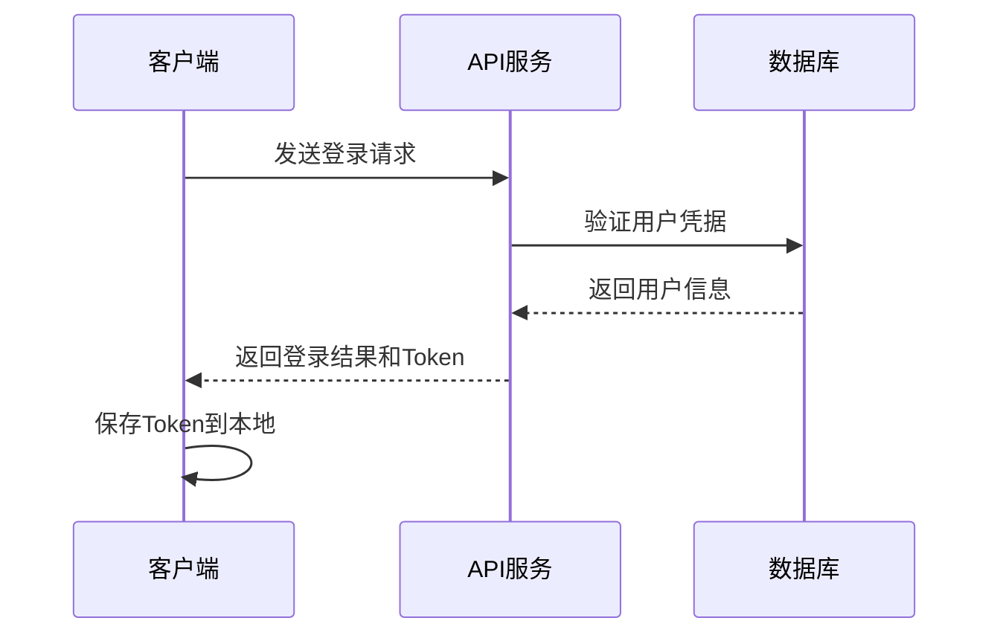

# 用户管理API

用户相关的API接口文档，包含登录、注册、信息获取和更新等功能。

## 用户登录

**接口名称：** 用户登录
**功能描述：** 用户通过用户名和密码进行登录认证，获取访问令牌
**接口地址：** `/api/user/login`
**请求方式：** POST

### 功能说明

用户登录流程：



### 请求参数

```json
{
  "username": "admin",
  "password": "123456"
}
```

| 参数名 | 类型 | 必填 | 说明 | 示例值 |
|--------|------|------|------|--------|
| username | string | 是 | 用户名 | admin |
| password | string | 是 | 密码 | 123456 |

### 响应参数

```json
{
  "error": 0,
  "body": {
    "token": "mock_token_1704067200000",
    "userInfo": {
      "user_id": 1,
      "username": "admin",
      "email": "admin@example.com",
      "status": "active",
      "avatar": "https://images.unsplash.com/photo-1472099645785-5658abf4ff4e?w=100&h=100&fit=crop&crop=face"
    }
  },
  "message": "登录成功",
  "success": true
}
```

| 参数名 | 类型 | 必填 | 说明 | 示例值 |
|--------|------|------|------|--------|
| error | int | 是 | 错误码，0表示成功 | 0 |
| body | object | 是 | 响应数据 | |
| body.token | string | 是 | 访问令牌 | mock_token_1704067200000 |
| body.userInfo | object | 是 | 用户信息 | |
| body.userInfo.user_id | int | 是 | 用户ID | 1 |
| body.userInfo.username | string | 是 | 用户名 | admin |
| body.userInfo.email | string | 是 | 邮箱地址 | admin@example.com |
| body.userInfo.status | string | 是 | 用户状态 | active |
| body.userInfo.avatar | string | 是 | 头像URL | https://... |
| message | string | 是 | 响应消息 | 登录成功 |
| success | bool | 是 | 是否成功 | true |

---

## 获取用户信息

**接口名称：** 获取用户基本信息
**功能描述：** 获取当前登录用户的详细信息
**接口地址：** `/api/user/info`
**请求方式：** GET

### 功能说明

获取当前登录用户的基本信息，需要在请求头中携带有效的访问令牌。

### 请求参数

无需请求参数，但需要在请求头中携带Authorization令牌。

### 响应参数

```json
{
  "error": 0,
  "body": {
    "user_id": 1,
    "username": "admin",
    "email": "admin@example.com",
    "status": "active",
    "avatar": "https://images.unsplash.com/photo-1472099645785-5658abf4ff4e?w=100&h=100&fit=crop&crop=face",
    "phone": "13888888888",
    "created_at": "2024-01-01 10:00:00"
  },
  "message": "获取用户信息成功",
  "success": true
}
```

| 参数名 | 类型 | 必填 | 说明 | 示例值 |
|--------|------|------|------|--------|
| error | int | 是 | 错误码 | 0 |
| body | object | 是 | 响应数据 | |
| body.user_id | int | 是 | 用户ID | 1 |
| body.username | string | 是 | 用户名 | admin |
| body.email | string | 是 | 邮箱地址 | admin@example.com |
| body.status | string | 是 | 用户状态 | active |
| body.avatar | string | 是 | 头像URL | https://... |
| body.phone | string | 是 | 手机号码 | 13888888888 |
| body.created_at | string | 是 | 创建时间 | 2024-01-01 10:00:00 |
| message | string | 是 | 响应消息 | 获取用户信息成功 |
| success | bool | 是 | 是否成功 | true |

---

## 用户注册

**接口名称：** 用户注册
**功能描述：** 新用户注册账号
**接口地址：** `/api/user/register`
**请求方式：** POST

### 功能说明

新用户注册流程，验证用户名唯一性，创建用户账号。

### 请求参数

```json
{
  "username": "newuser",
  "password": "123456",
  "email": "newuser@example.com"
}
```

| 参数名 | 类型 | 必填 | 说明 | 示例值 |
|--------|------|------|------|--------|
| username | string | 是 | 用户名 | newuser |
| password | string | 是 | 密码 | 123456 |
| email | string | 是 | 邮箱地址 | newuser@example.com |

### 响应参数

```json
{
  "error": 0,
  "body": {
    "user_id": 1704067200000,
    "username": "newuser",
    "email": "newuser@example.com",
    "status": "active",
    "created_at": "2024-01-01T10:00:00.000Z"
  },
  "message": "注册成功",
  "success": true
}
```

| 参数名 | 类型 | 必填 | 说明 | 示例值 |
|--------|------|------|------|--------|
| error | int | 是 | 错误码 | 0 |
| body | object | 是 | 响应数据 | |
| body.user_id | int | 是 | 用户ID | 1704067200000 |
| body.username | string | 是 | 用户名 | newuser |
| body.email | string | 是 | 邮箱地址 | newuser@example.com |
| body.status | string | 是 | 用户状态 | active |
| body.created_at | string | 是 | 创建时间 | 2024-01-01T10:00:00.000Z |
| message | string | 是 | 响应消息 | 注册成功 |
| success | bool | 是 | 是否成功 | true |

---

## 更新用户信息

**接口名称：** 更新用户信息
**功能描述：** 更新当前用户的基本信息
**接口地址：** `/api/user/update`
**请求方式：** POST

### 功能说明

更新当前登录用户的基本信息，如用户名、邮箱、头像等。

### 请求参数

```json
{
  "username": "newusername",
  "email": "newemail@example.com",
  "avatar": "https://images.unsplash.com/photo-1234567890?w=100&h=100&fit=crop"
}
```

| 参数名 | 类型 | 必填 | 说明 | 示例值 |
|--------|------|------|------|--------|
| username | string | 否 | 新用户名 | newusername |
| email | string | 否 | 新邮箱地址 | newemail@example.com |
| avatar | string | 否 | 新头像URL | https://... |

### 响应参数

```json
{
  "error": 0,
  "body": {
    "user_id": 1,
    "username": "newusername",
    "email": "newemail@example.com",
    "avatar": "https://images.unsplash.com/photo-1234567890?w=100&h=100&fit=crop",
    "updated_at": "2024-01-01T10:00:00.000Z"
  },
  "message": "更新用户信息成功",
  "success": true
}
```

| 参数名 | 类型 | 必填 | 说明 | 示例值 |
|--------|------|------|------|--------|
| error | int | 是 | 错误码 | 0 |
| body | object | 是 | 响应数据 | |
| body.user_id | int | 是 | 用户ID | 1 |
| body.username | string | 是 | 用户名 | newusername |
| body.email | string | 是 | 邮箱地址 | newemail@example.com |
| body.avatar | string | 是 | 头像URL | https://... |
| body.updated_at | string | 是 | 更新时间 | 2024-01-01T10:00:00.000Z |
| message | string | 是 | 响应消息 | 更新用户信息成功 |
| success | bool | 是 | 是否成功 | true |

---

## 错误码说明

| 错误码 | 说明 | 解决方案 |
|--------|------|----------|
| 0 | 操作成功 | - |
| 1 | 通用错误 | 检查请求参数 |
| 1001 | 用户名或密码错误 | 检查登录凭据 |
| 1002 | 用户名已存在 | 更换用户名 |
| 1003 | 必填字段不能为空 | 补全必填参数 |
| 401 | 未授权访问 | 检查Token是否有效 |
| 403 | 权限不足 | 联系管理员 |
| 500 | 服务器内部错误 | 联系技术支持 |

## Mock数据说明

开发环境下，所有用户API都使用Mock数据：

- **测试账号**: username: `admin`, password: `123456`
- **Mock延迟**: 登录800ms，其他接口300-1000ms
- **数据持久化**: 使用localStorage模拟 